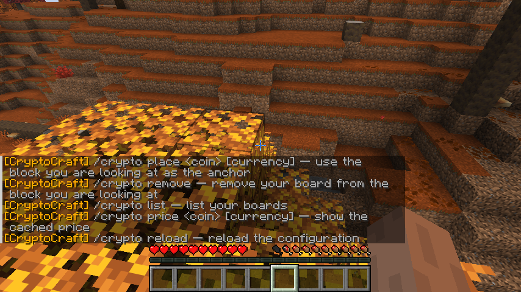
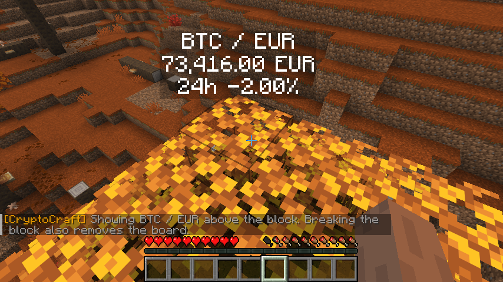

# CryptoCraft


CryptoCraft displays a visual cryptocurrency price chart above ordinary Minecraft blocks on Paper and Purpur. The block remains a normal vanilla block, so players can still interact with it as usual. The chart uses a plugin-rendered map in an invisible, fixed item frame; it is removed when the anchor block is broken and never drops as a map item or frame.

[](https://github.com/furany/CryptoCraft/actions/workflows/build.yml)

## Download

Download the latest compiled plugin JAR from [GitHub Releases](https://github.com/furany/CryptoCraft/releases/latest). Place it in your server's `plugins` directory and restart Paper or Purpur.

## Screenshots

The screenshots below show the original v1.0 text display. Current versions show the visual chart instead.

Command help in game:



BTC/EUR price board in game:



## Requirements

- Paper or Purpur 26.3
- Java 25
- Gradle (for local builds)

## Build locally

Install a Java 25 JDK and Gradle, then run this from the project directory:

```sh
gradle clean build
```

The JAR is written to `build/libs/` (currently `CryptoCraft-1.0.0.jar`). Copy it into your server's `plugins` directory and restart the server.

## Build with GitHub Actions

The workflow in `.github/workflows/build.yml` builds the JAR on every push and pull request. It can also be started manually from the repository's **Actions** tab using **Build CryptoCraft → Run workflow**.

When a workflow run finishes, open that run in **Actions**, then download the **CryptoCraft** artifact. The downloaded ZIP contains the plugin JAR.

Pushing a version tag such as `v1.0.0` starts `.github/workflows/release.yml`, which builds the plugin and attaches the JAR to a public GitHub Release.

## Use in game

Look at a vanilla block and run:

```text
/crypto place BTC EUR
```

The board appears above that block. Its normal use is unchanged. Breaking the anchor block removes the board and frees the owner's slot. `/crypto remove` removes only the floating display and leaves the block in place.

Commands:

- `/crypto place <coin> [currency]` — place a board on the block you are looking at
- `/crypto remove` — remove your board from the block you are looking at
- `/crypto list` — list your boards; users with teleport permission can click one to teleport
- `/crypto tp <board-id>` — teleport to one of your boards (admins can teleport to any board)
- `/crypto price <coin> [currency]` — show the cached price
- `/crypto reload` — reload the configuration (admin permission required)

BTC, ETH, and SOL are configured by default. EUR is the default currency; EUR, USD, and TRY (Turkish lira) are available. For example, use `/crypto place BTC USD` for the Bitcoin price in US dollars or `/crypto place BTC TRY` for Turkish lira. All active boards share one price request per refresh interval.

## Configuration

Edit `plugins/CryptoCraft/config.yml`, then run `/crypto reload`.

```yaml
prices:
  refresh-interval-seconds: 300
  minimum-request-interval-seconds: 60
  request-timeout-seconds: 20
  stale-after-minutes: 10
  history-retention-days: 7
  retry:
    initial-delay-seconds: 60
    maximum-delay-seconds: 3600

boards:
  default-limit-per-player: 1
  admin-bypass-limit: true
  admin-permission: cryptocraft.admin
  unlimited-permission: cryptocraft.limit.unlimited
  permission-limits:
    cryptocraft.limit.vip: 3
    cryptocraft.limit.elite: 5
  display-height: 1.35
  chart-history-hours: 24

api:
  url: "https://api.coingecko.com/api/v3/simple/price"
  demo-key: ""
  query:
    coin-ids-parameter: ids
    currencies-parameter: vs_currencies
    include-24hr-change: true
    include-last-updated-at: true
    additional-parameters: {}

coins:
  BTC: bitcoin
  ETH: ethereum
  SOL: solana

currencies:
  - EUR
  - USD
  - TRY

default-currency: EUR
```

`refresh-interval-seconds` controls automatic polling. `default-currency` is used when a command omits its optional currency argument. `minimum-request-interval-seconds` is a global floor for all requests, including a refresh triggered when a board is placed. Retry delays grow exponentially after HTTP 429 responses and stop growing at `maximum-delay-seconds`. Cached prices are marked stale after `stale-after-minutes`.

Charts show the most recent `boards.chart-history-hours` hours. The left axis labels the price at each horizontal grid line, and the bottom axis shows the time window. The header shows the latest price and 24-hour change; the line color reflects movement over the displayed chart window. CryptoCraft samples prices during its existing batched refreshes and retains up to `prices.history-retention-days` days in `plugins/CryptoCraft/history.yml`. No chart-specific API requests are made. A new server starts collecting chart history after the first price refresh; the graph fills in as samples arrive.

Set `language` in `plugins/CryptoCraft/messages.yml` to `en` or `de` to choose English or German command messages. You can edit the language strings in that file and apply changes with `/crypto reload`. Commands provide tab completion for configured coins, currencies, and board IDs.

Set `api.url` to a CoinGecko Simple Price compatible endpoint. The query parameter names for coin IDs and currencies, the optional 24-hour-change and update-time flags, and extra string-valued query parameters can be changed under `api.query`. Coin symbols map to CoinGecko coin IDs under `coins`; currencies are listed under `currencies`.

## Player limits and permissions

Players may place one board by default. A matching permission in `boards.permission-limits` sets that player's limit; if more than one configured permission matches, the highest matching limit applies. Players with the configured unlimited permission bypass the limit. Admins bypass it as well while `boards.admin-bypass-limit` is enabled.

LuckPerms examples:

```text
/lp group vip permission set cryptocraft.limit.vip true
/lp group elite permission set cryptocraft.limit.elite true
/lp group staff permission set cryptocraft.limit.unlimited true
/lp group admin permission set cryptocraft.admin true
/lp group admin permission set cryptocraft.teleport true
```

`cryptocraft.teleport` defaults to operators. Grant it explicitly to allow non-admin players to teleport to their own boards; players without it cannot use `/crypto tp` or clickable board entries. Admins (the permission configured at `boards.admin-permission`) can teleport to any board.

The plugin uses Bukkit permissions directly and has no API dependency on LuckPerms, EssentialsX, or Vault. EssentialsX can remain installed; CryptoCraft uses the `/crypto` command.

## CoinGecko API

With an empty `api.demo-key`, CryptoCraft uses CoinGecko's keyless Public API. CoinGecko documents a dynamic shared limit of roughly 10–30 calls per minute per public IP, but says the keyless API is not intended for scheduled polling in production. CryptoCraft batches all active boards into one request every five minutes by default and backs off after HTTP 429 responses. Servers sharing one public IP also share CoinGecko's IP-based limit. For more reliable polling, set a Demo API key in `api.demo-key`.

See CoinGecko's [keyless Public API documentation](https://docs.coingecko.com/docs/keyless-public-api) for current limits and usage guidance.
