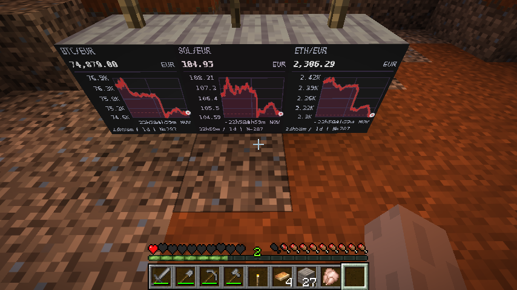

# CryptoCraft


CryptoCraft displays a visual cryptocurrency price chart above ordinary Minecraft blocks on Spigot, Paper, and Purpur. The block remains a normal vanilla block, so players can still interact with it as usual. The chart uses a plugin-rendered map in an invisible, fixed item frame; it is removed when the anchor block is broken and never drops as a map item or frame.

[](https://github.com/furany/CryptoCraft/actions/workflows/build.yml)

## Download

Download the latest compiled plugin JAR from [GitHub Releases](https://github.com/furany/CryptoCraft/releases/latest). Place it in your server's `plugins` directory and restart the server.

## In-game screenshot

Current chart overview showing BTC/EUR, SOL/EUR, and ETH/EUR boards:



## Requirements

- Spigot, Paper, or Purpur 26.3
- Java 25
- The checked-in Gradle wrapper downloads the pinned Gradle version for local builds.

## Build locally

Install a Java 25 JDK, then run this from the project directory:

```sh
./gradlew clean build
```

On Windows use `gradlew.bat clean build`. The build runs the automated tests before completing.

The JAR is written to `build/libs/` (currently `CryptoCraft-1.1.0.jar`). Copy it into your server's `plugins` directory and restart the server.

## Build with GitHub Actions

The workflow in `.github/workflows/build.yml` builds the JAR on every push and pull request. It can also be started manually from the repository's **Actions** tab using **Build CryptoCraft → Run workflow**.

When a workflow run finishes, open that run in **Actions**, then download the **CryptoCraft** artifact. The downloaded ZIP contains the plugin JAR.

Pushing a version tag such as `v1.0.0` starts `.github/workflows/release.yml`, which builds the plugin and attaches the JAR to a public GitHub Release.

## Use in game

Look at a vanilla block and run:

```text
/crypto place BTC EUR
```

The board appears above that block. Its normal use is unchanged. Breaking the anchor block removes the board and frees the owner's slot. `/crypto remove` removes only the floating display and leaves the block in place.

Run `/crypto` for help. `/cryptocraft` is an alias for `/crypto`.

Commands:

- `/crypto place <coin> [currency]` — place a chart above the block you are looking at. Currency is optional and defaults to EUR.
- `/crypto remove` — remove your chart from the block you are looking at; admins can remove any chart.
- `/crypto list` — list your charts. Admins see all charts; players see their own. Players with teleport permission can click an entry to teleport.
- `/crypto tp <board-id>` — teleport to one of your charts. Requires `cryptocraft.teleport`; admins can teleport to any chart.
- `/crypto price <coin> [currency]` — show the cached price for a configured coin.
- `/crypto reload` — reload the plugin configuration and messages; requires the configured admin permission.

Tab completion suggests configured coins, currencies, and board IDs you can access.

BTC, ETH, and SOL are configured by default. EUR is the default currency; EUR, USD, and TRY (Turkish lira) are available. For example, use `/crypto place BTC USD` for the Bitcoin price in US dollars or `/crypto place BTC TRY` for Turkish lira. Boards, watchlists, alerts, virtual holdings, and temporary command requests share batched price requests subject to the global minimum interval.

## Configuration

Edit `plugins/CryptoCraft/config.yml`, then run `/crypto reload`.

```yaml
prices:
  refresh-interval-seconds: 300
  minimum-request-interval-seconds: 60
  request-timeout-seconds: 20
  stale-after-minutes: 10
  history-retention-days: 7
  retry:
    initial-delay-seconds: 60
    maximum-delay-seconds: 3600
    access-error-initial-delay-seconds: 900
    access-error-maximum-delay-seconds: 3600

boards:
  default-limit-per-player: 1
  admin-bypass-limit: true
  admin-permission: cryptocraft.admin
  unlimited-permission: cryptocraft.limit.unlimited
  permission-limits:
    cryptocraft.limit.vip: 3
    cryptocraft.limit.elite: 5
  display-height: 1.35
  chart-history-hours: 24

api:
  url: "https://api.coingecko.com/api/v3/simple/price"
  auth-mode: demo
  demo-key: ""
  pro-key: ""
  query:
    coin-ids-parameter: ids
    currencies-parameter: vs_currencies
    include-24hr-change: true
    include-last-updated-at: true
    additional-parameters: {}

coins:
  BTC: bitcoin
  ETH: ethereum
  SOL: solana

currencies:
  - EUR
  - USD
  - TRY

default-currency: EUR
```

`refresh-interval-seconds` controls automatic polling. `default-currency` is used when a command omits its optional currency argument. `minimum-request-interval-seconds` is a global floor for all requests, including a refresh triggered when a board is placed. HTTP 429 retries honor `Retry-After` and use exponential backoff up to `maximum-delay-seconds`. HTTP 401/403 responses use a separate, longer backoff configured by `access-error-initial-delay-seconds` and `access-error-maximum-delay-seconds`; repeated warnings for the same status are suppressed until the status changes, the API recovers, or `/crypto reload` is run. Error details are shortened and API keys are redacted from logs.

After `stale-after-minutes` without a fresh quote, the chart replaces its 24-hour change with an orange `STALE` label and the quote age (`ALT` in German). The cached price remains visible while the API is unavailable.

Charts show up to the most recent the board’s selected window (initially `boards.chart-history-hours`). The plot uses the collected history across the full graph width while data is warming up; its footer shows collected time versus the selected window and the number of samples. The left axis labels price, the bottom axis labels time, and the shaded line highlights the recent price movement. The header shows the latest price and 24-hour change. CryptoCraft samples prices during its existing batched refreshes and retains up to `prices.history-retention-days` days in `plugins/CryptoCraft/history.yml`. Normal chart updates make no chart-specific API requests. Optional initial history imports have a separate hourly budget and also respect the global request floor and API backoff.

Set `language` in `plugins/CryptoCraft/messages.yml` to `en` or `de` to choose English or German command and chart messages. You can edit the language strings in that file and apply changes with `/crypto reload`.

Set `api.url` to a CoinGecko Simple Price compatible endpoint. The query parameter names for coin IDs and currencies, the optional 24-hour-change and update-time flags, and extra string-valued query parameters can be changed under `api.query`. Coin symbols map to CoinGecko coin IDs under `coins`; currencies are listed under `currencies`.

## Player limits and permissions

Players may place one board by default. A matching permission in `boards.permission-limits` sets that player's limit; if more than one configured permission matches, the highest matching limit applies. Players with the configured unlimited permission bypass the limit. Admins bypass it as well while `boards.admin-bypass-limit` is enabled.

LuckPerms examples:

```text
/lp group vip permission set cryptocraft.limit.vip true
/lp group elite permission set cryptocraft.limit.elite true
/lp group staff permission set cryptocraft.limit.unlimited true
/lp group admin permission set cryptocraft.admin true
/lp group admin permission set cryptocraft.teleport true
```

`cryptocraft.teleport` defaults to operators. Grant it explicitly to allow non-admin players to teleport to their own boards; players without it cannot use `/crypto tp` or clickable board entries. Admins (the permission configured at `boards.admin-permission`) can teleport to any board.

The plugin uses Bukkit permissions directly and has no API dependency on LuckPerms, EssentialsX, or Vault. WorldGuard and PlaceholderAPI are optional integrations. EssentialsX can remain installed; CryptoCraft uses the `/crypto` command.

## CoinGecko API

With `api.auth-mode: demo`, CryptoCraft sends `api.demo-key` using the Demo API header. If the key is empty, it uses CoinGecko's keyless Public API. For a paid plan, set `api.auth-mode: pro` and provide `api.pro-key`; the plugin uses the Pro API header and switches the default endpoint to `pro-api.coingecko.com`. A custom `api.url` is left unchanged in either mode. The plugin sends a descriptive User-Agent and logs a shortened API error response plus a request ID when available.

CoinGecko distinguishes access-denied HTTP 403 errors from HTTP 429 rate limiting. A valid Demo key may help with public API access; a 403 can also require CoinGecko to unblock the server's outbound IP. CryptoCraft keeps the last cached prices during errors.

See CoinGecko's [keyless Public API documentation](https://docs.coingecko.com/docs/keyless-public-api) for current limits and usage guidance.


## Board editing and menu

`/crypto menu` opens a paginated list of your boards (all boards for admins). Click a board to cycle its coin, currency, time window, direction, height, theme, view, wall size, and high/low footer. Renaming asks for chat input for 60 seconds; type `cancel` to cancel or `-` to clear the name. Removing a board from the menu requires a second click to confirm. Ownership, permissions, and region protection are checked again when an action runs.

You can also edit directly:

```text
/crypto edit <board-id> coin ETH
/crypto edit <board-id> currency USD
/crypto edit <board-id> hours 168
/crypto edit <board-id> facing north
/crypto edit <board-id> height 2.0
/crypto edit <board-id> name My Bitcoin chart
/crypto edit <board-id> theme light
/crypto edit <board-id> style price
/crypto edit <board-id> size 3
/crypto edit <board-id> range true
/crypto remove <board-id>
```

Get IDs from `/crypto list` or tab completion. Settings accept 1–168 hours, heights from 0.5 to 8 blocks, names up to 32 printable characters, themes `dark|light|ocean`, views `chart|price|compact`, and square walls of `1|2|3` maps per side. Walls count as one board. Their bottom row starts at the configured height above the anchor; columns expand symmetrically to the sides. Unloaded neighboring chunks are not force-loaded; their tiles appear when the chunks load. Growing or rotating a wall checks the full footprint against WorldGuard.

`cryptocraft.edit` defaults to everyone, but players can only edit their own boards. Per-board settings are persisted. Legacy boards use the configured default height and history window on their first load; those defaults apply to newly created boards afterward.

## Watchlists, comparison and alerts

```text
/crypto watch add BTC EUR
/crypto watch remove BTC EUR
/crypto watch list
/crypto compare BTC ETH EUR 24
/crypto alert add BTC EUR above 70000 once
/crypto alert add ETH USD below 2000 repeat
/crypto alert list
/crypto alert remove <alert-id>
```

Watchlist currencies are optional and use `default-currency`. Comparison shows percentage change from the first available sample in the selected window and reports actual coverage and quote freshness. Alerts use inclusive thresholds (`above` means >= and `below` means <=). Repeating alerts rearm only after the quote moves to the opposite side, and respect `players.alarm-cooldown-seconds`. Old quotes never fire alerts. Up to 20 offline notifications per player are queued and delivered on login. Completed one-shot alerts remain visible until removed.

The default watchlist and alert limits are both 20, configured with `players.watchlist-limit` and `players.alarm-limit`. `cryptocraft.alert` defaults to everyone.

`/crypto price` can request configured pairs even without a board. Requests are queued through the shared polling lane; a new pair can wait for the minimum interval or an API retry delay. It displays the API timestamp, age in seconds, and freshness. English and German number formatting follow `messages.yml`.

## Redstone signals

Place a lever directly above your board's anchor, then run:

```text
/crypto signal <board-id> above 70000
/crypto signal <board-id> below 50000
```

A signal is a repeating alert linked to that board and appears in `/crypto alert list`. The existing lever stays powered while a fresh cached quote matches the threshold. Multiple rules on one board are combined with OR. Signals turn off on stale quotes, when disabled in config, when their rule/board is removed, and when the plugin stops. They resume from persisted rules when their chunk loads. The plugin does not create or replace blocks and does not load chunks to update a lever.

Signal creation requires ownership (or admin permission), `cryptocraft.signal` (operators by default), and permission to modify the lever's region. Set `players.redstone-enabled: false` to disable output.

## Virtual portfolio

Enable `portfolio.enabled: true` to allow paper trading with virtual cash:

```yaml
portfolio:
  enabled: true
  currency: EUR
  starting-cash: "10000"
```

```text
/crypto portfolio
/crypto portfolio buy BTC 0.01
/crypto portfolio sell BTC 0.005
/crypto portfolio history
```

Each player gets the configured starting balance on first use. Existing accounts keep their currency and balance when defaults change. Trades require fresh cached prices, positive quantities with at most 12 decimal places, sufficient virtual cash or holdings, and `cryptocraft.portfolio`. The ledger tracks holdings, average acquisition cost, realized profit, total value, and the last 100 trades. Valuations label missing or stale quotes as incomplete. Previously held coins can still be sold if their symbol is removed from config.

This feature uses game money only; it does not connect to real wallets or Vault balances. Accounts, watchlists, alerts, and pending notifications are stored in `players.yml`.

## Optional history import and integrations

Enable `prices.backfill.enabled: true` to import initial history once per coin/currency pair. `prices.backfill.days` defaults to 7 and `prices.backfill.maximum-requests-per-hour` defaults to 6. The shared HTTP lane prioritizes live polling, honors the global minimum interval and `Retry-After`, and merges imported samples with locally collected samples. Completed imports are persisted across restarts. A pair whose history has expired can be imported again. Custom price providers must explicitly configure a compatible `prices.backfill.url` containing `{id}`; the default CoinGecko history URL is only derived for the standard CoinGecko price endpoints.

If WorldGuard is installed and `integrations.worldguard` is enabled, creating/editing/removing boards and linking signals respects its BUILD flag, including WorldGuard bypass permissions. A failed protection query denies the modification.

If PlaceholderAPI is installed and `integrations.placeholderapi` is enabled, the internal expansion supplies:

```text
%cryptocraft_price_BTC_EUR%
%cryptocraft_change_BTC_EUR%
%cryptocraft_age_BTC_EUR%
%cryptocraft_stale_BTC_EUR%
%cryptocraft_boards%
%cryptocraft_virtual_cash%
%cryptocraft_virtual_currency%
```

`change` is the API's 24-hour percentage change, and `age` is in seconds. Missing cached values are empty. Placeholders only read caches and never perform HTTP, disk or world operations. Enable `integrations.placeholderapi-preload` to poll all configured pairs even without boards or watchlists. Neither optional plugin is needed to run CryptoCraft.

## Administration, persistence and validation

`/crypto status` (configured admin permission) reports board count, last successful live-price request, earliest permitted next request, in-flight state, API failure state, and storage errors. Times are UTC; an epoch timestamp means no successful request in this server session.

`/crypto reload` validates both YAML files before applying changes. Invalid values reject the reload with actionable configuration paths. Old in-flight HTTP results are discarded after reload or shutdown, while cached quotes remain available. Missing new message keys fall back to the bundled translations without overwriting custom messages.

Boards are cleaned up after anchor destruction by players, explosions, or piston movement. Periodic validation catches anchors removed by external tools in loaded chunks. Displays are protected against removal, rotation, and item extraction. Teleports reject dangerous blocks, liquids, partial-height floors and positions outside the world border.

All data writes are coalesced on one background writer, use temporary files and atomic replacement where supported, and keep the preceding version in `.bak`. Startup can recover missing or syntactically damaged primary YAML from its backup and retains damaged input in `.damaged`. Invalid unrecoverable data stops startup instead of overwriting saved state. Shutdown flushes pending writes; an abrupt crash can lose changes from the last two seconds.

Chart images are computed on a separate worker from immutable snapshots, cached across matching boards, and copied to map canvases only when the image changes. Chunk/entity indexes reduce repeated searches during normal refreshes.

The automated suite covers numerical parsing, historical imports, retry delays, stale data, request gating and reload generations, authorization, persistence/recovery, portfolio accounting, alert rearming, configuration defaults, geometry and raster rendering. Generated theme/view previews are in `build/chart-previews/`; test reports are in `build/reports/tests/test/`. A live server check is still needed for final in-game menu, entity and cross-plugin behavior on the intended Spigot/Paper/Purpur build.
