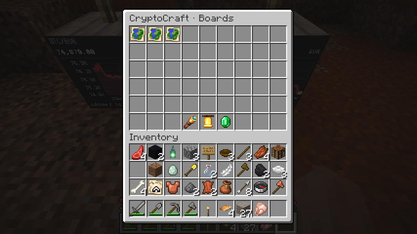
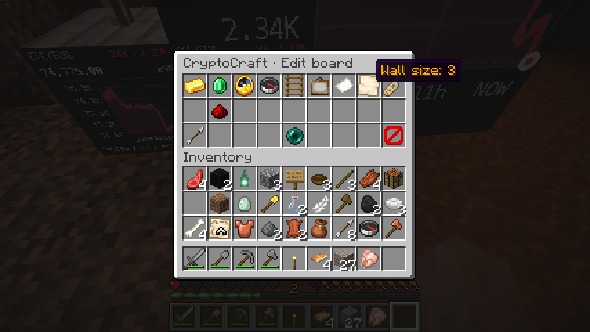
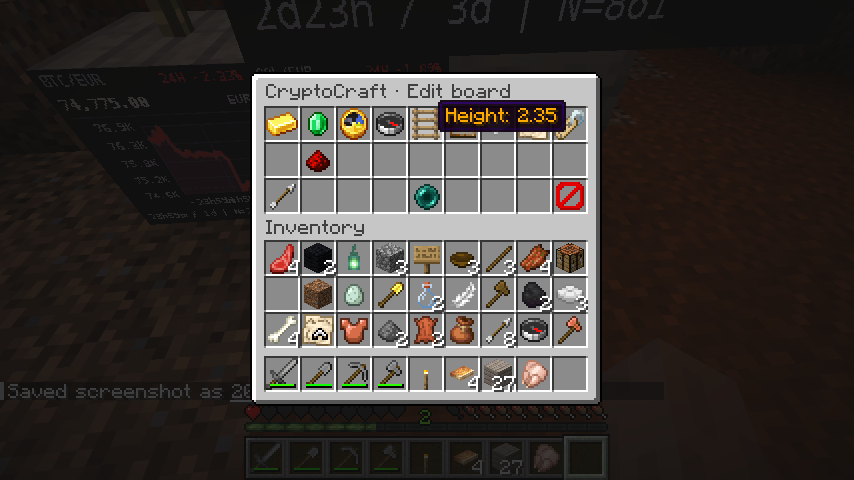
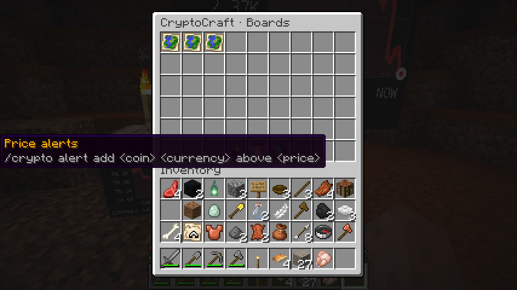
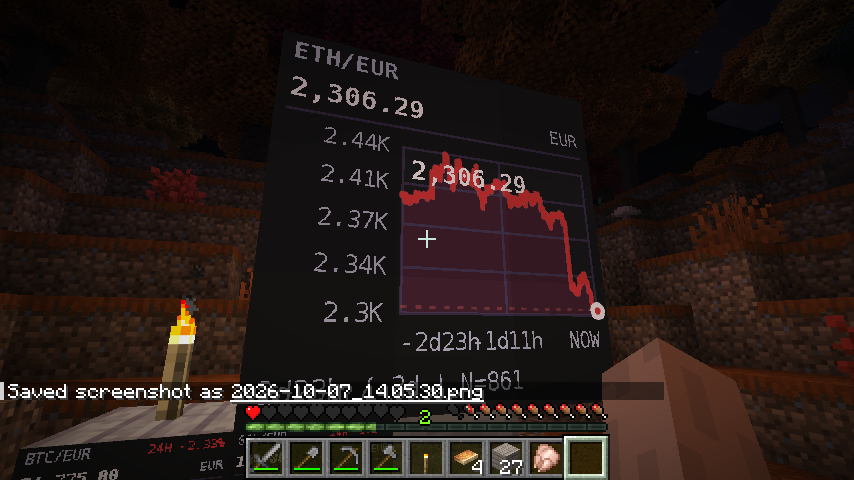

# CryptoCraft

CryptoCraft displays cryptocurrency prices and history on floating map boards above ordinary Minecraft blocks. Supports **Spigot, Paper, and Purpur 26.3**. Boards can be edited through an inventory menu and expanded to **3 x 3 maps**.

The anchor remains a normal vanilla block. Breaking it removes the attached board and frees the owner's board slot. Charts retain the last cached quote during API outages and visibly mark stale data.

## Features in 1.1.0

- **Board menu and editor:** change coin, currency, name, facing, height, history window, theme, view, and wall size in game.
- **Chart settings:** dark, light, or ocean themes; chart, price, or compact views; optional high/low values; 1-168 hour history windows.
- **Watchlists and comparisons:** save coin/currency pairs and compare their percentage changes over the available history.
- **Price alerts:** one-shot or repeating threshold notifications, including queued messages for offline players.
- **Redstone signals:** power an existing lever above a board's anchor while a fresh quote matches a threshold.
- **Optional virtual portfolio:** paper trading with virtual cash, holdings, profit tracking, and trade history.
- **Optional WorldGuard and PlaceholderAPI support:** respect protected regions and expose cached prices to other plugins.
- **Server administration:** configurable board limits, Bukkit permissions, English/German messages, and `/crypto status` diagnostics.

## Screenshots

Captured on Minecraft 26.3 on October 7, 2026.

### Live BTC, SOL, and ETH charts

BTC, SOL, and ETH boards show cached EUR prices and price history above ordinary blocks.


### Board menu

Open `/crypto menu` to select a board or use the watchlist, alert, and portfolio shortcuts.



### Wall-size control

The editor's wall-size setting expands a board up to three maps per side.



### Height control

Adjust a board's height above its anchor; this example uses 2.35 blocks.



### Price-alert shortcut

The menu opens your alert list and shows how to add a threshold notification.



### Large ETH chart wall

ETH/EUR price history on a 3 x 3 map wall.



## Installation

1. Run **Java 25** and **Spigot, Paper, or Purpur 26.3**.
2. Put `CryptoCraft-1.1.0.jar` in the server's `plugins` folder and restart.
3. Look at a block and run `/crypto place BTC EUR`.
4. Open `/crypto menu` to customize the board.

BTC, ETH, and SOL are included by default. EUR is the default currency; USD and TRY are also configured. Add other coins and currencies in `plugins/CryptoCraft/config.yml`.

```text
/crypto place BTC EUR
/crypto menu
/crypto list
/crypto price ETH USD
/crypto watch add SOL EUR
/crypto compare BTC ETH EUR 24
/crypto alert add BTC EUR above 70000 once
/crypto alert add ETH USD below 2000 repeat
```

Use `/crypto list` to find board IDs. Edit a board with:

```text
/crypto edit <board-id> theme ocean
/crypto edit <board-id> hours 72
/crypto edit <board-id> size 3
/crypto edit <board-id> name My ETH chart
/crypto remove <board-id>
```

`/crypto tp <board-id>` requires teleport permission. `/crypto reload` and `/crypto status` require the configured admin permission.

## Optional features

Enable `portfolio.enabled: true` in `config.yml` for virtual trading, then use `/crypto portfolio`, `/crypto portfolio buy BTC 0.01`, or `/crypto portfolio history`. New accounts start with 10,000 virtual EUR by default. Trades require fresh quotes and sufficient cash or holdings. The portfolio uses game money and does not connect to real wallets.

Enable `prices.backfill.enabled: true` to import initial history. Charts otherwise build their history from scheduled price updates. Imports share the API request limit and have a separate hourly budget.

For redstone, place a lever directly above a board's anchor and run `/crypto signal <board-id> above 70000`. Signals require the `cryptocraft.signal` permission and follow fresh cached prices.

WorldGuard and PlaceholderAPI are optional. When installed and enabled, WorldGuard protects board modifications, and PlaceholderAPI exposes values such as `%cryptocraft_price_BTC_EUR%`, `%cryptocraft_change_BTC_EUR%`, and `%cryptocraft_boards%`.

## Configuration and permissions

Edit `plugins/CryptoCraft/config.yml` and run `/crypto reload`. Players get one board by default; configure limits and permission overrides for your server. Players manage their own boards, while admins can manage all boards. LuckPerms works through Bukkit permissions and is not required.

English and German messages are supplied; choose the language in `messages.yml`. Optional history import and virtual trading are disabled by default.

Prices come from CoinGecko or a compatible provider. Requests are batched and rate-limited. Failed requests are retried with increasing delays; old quotes are marked stale. A CoinGecko Demo key can be configured in `config.yml`. The default refresh interval is five minutes.

## Upgrading and support

Back up `plugins/CryptoCraft/`, stop the server, replace the old JAR, and restart. Existing boards and custom messages are preserved; missing new keys use bundled defaults.

See the [source and full documentation](https://github.com/furany/CryptoCraft), [report an issue](https://github.com/furany/CryptoCraft/issues), or read the [1.1.0 changelog](https://github.com/furany/CryptoCraft/blob/dev/CHANGELOG.md). CryptoCraft is open source under the MIT license.
